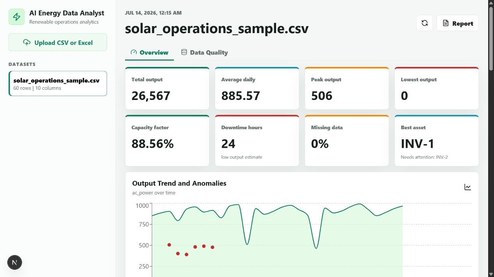
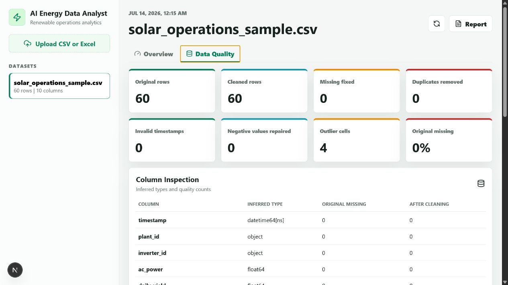
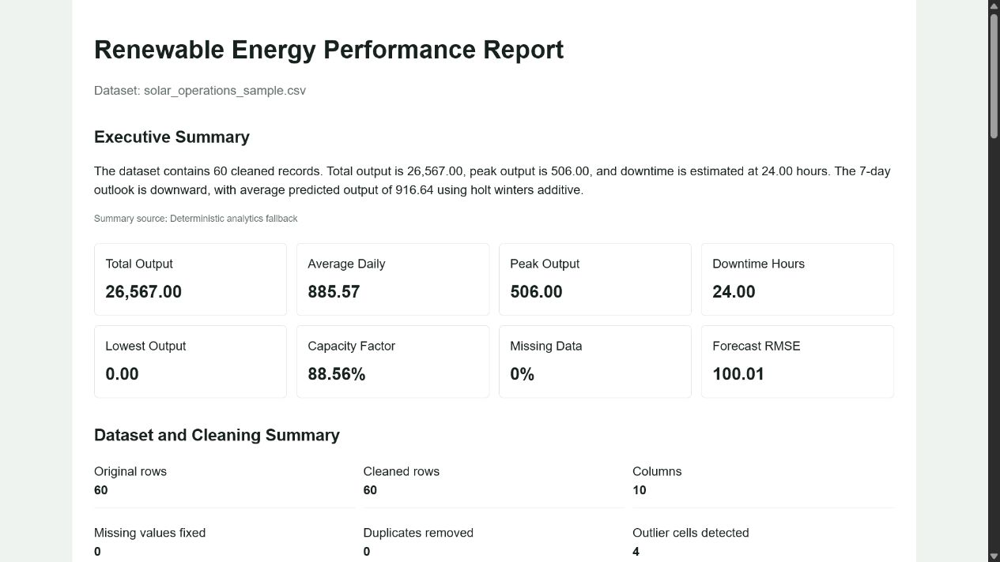
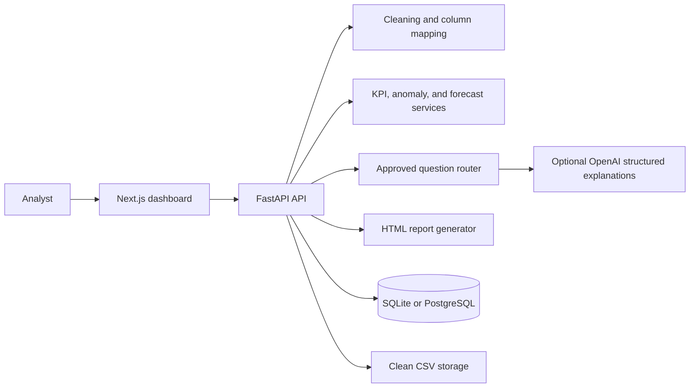

# AI Energy Data Analyst

AI Energy Data Analyst is a full-stack renewable-energy operations tool built for analysts and engineering teams. It turns raw solar, wind, demand, weather, or maintenance files into a validated dataset, energy KPIs, anomaly evidence, forecasts, safe natural-language analysis, and a business-ready HTML report.

## Problem Statement

Renewable operations data is often spread across telemetry exports with inconsistent column names, missing readings, duplicated events, and unclear status semantics. Analysts need a repeatable way to assess production, identify assets that deserve attention, estimate future output, and communicate findings without allowing an LLM to execute arbitrary code or invent calculations.

This project keeps calculations deterministic in Python. The optional OpenAI layer classifies questions into approved intents and explains verified aggregate findings through Pydantic-validated structured outputs.

## Deployment Preview

The repository includes a one-click Render Blueprint in `render.yaml` for the Next.js app, FastAPI service, and PostgreSQL database. The configured application URL will be:

`https://ammar081-energy-analyst.onrender.com`

The URL becomes available after the Blueprint is connected and the first deployment completes. Free Render services can take a short time to wake after inactivity.

## Screenshots

### Operations Overview



### Data Quality Inspection



### Generated Report



## Features

- CSV and Excel upload with type and size validation
- column standardization, datetime and numeric inference, duplicate removal, missing-value repair, invalid negative handling, and outlier evidence
- original and cleaned row counts, inferred dtypes, per-column missing values, analysis mapping, and sample-row inspection
- total, average daily, peak, lowest, capacity factor, status-aware downtime, original missing-data percentage, and asset rankings
- daily production, asset comparison, weather relationship, anomaly overlay, and forecast charts
- z-score, rolling-average, Isolation Forest, good-weather/low-output, repeated-zero, missing-telemetry, and telemetry-gap detection
- 7, 14, and 30 day forecasts with Holt-Winters, regression, or moving-average fallback, confidence ranges, MAE, and RMSE
- safe question routing for approved analysis functions, including month-aware asset comparison, largest daily drop, and factor correlations
- structured business explanations covering what happened, why it matters, a possible reason, and the next action
- chart-rich HTML report with data quality, KPIs, anomalies, forecast, executive summary, and recommendations
- SQLite locally, PostgreSQL in Docker and Render, plus Docker Compose, pytest, Ruff, and GitHub Actions

## Tech Stack

Backend: Python 3.12, FastAPI, pandas, NumPy, scikit-learn, statsmodels, OpenAI Python SDK, Pydantic, SQLAlchemy, SQLite/PostgreSQL

Frontend: Next.js 16, React 19, TypeScript, Recharts, lucide-react

Quality and delivery: pytest, Ruff, Docker, Docker Compose, GitHub Actions, Render Blueprint

## Architecture



The OpenAI API never receives the full uploaded dataset. It receives only bounded, computed findings. When `OPENAI_API_KEY` is absent or an API request fails, the same endpoint returns a transparent deterministic explanation with `source: "rules"`.

## Project Structure

```text
backend/app/          FastAPI routes, schemas, database, and analysis services
backend/tests/        Unit and end-to-end API tests
frontend/app/         Next.js application shell and responsive styling
frontend/components/  Dashboard experience
frontend/lib/         Typed API client
data/sample/          Synthetic dataset for local evaluation
docs/screenshots/     Verified application and report screenshots
render.yaml           Production deployment Blueprint
```

## Local Setup

Prerequisites: Python 3.12+, Node.js 22+, and npm.

Backend:

```powershell
cd backend
python -m venv .venv
.\.venv\Scripts\Activate.ps1
pip install -r requirements.txt
uvicorn app.main:app --reload
```

Frontend in a second terminal:

```powershell
cd frontend
npm install
npm run dev
```

Open [http://localhost:3000](http://localhost:3000). Interactive API documentation is available at [http://localhost:8000/docs](http://localhost:8000/docs).

Copy `.env.example` to `.env` only when you need configuration changes. Add `OPENAI_API_KEY` to enable OpenAI-assisted intent classification, explanations, and executive summaries. Keep the key server-side; the app remains fully functional without it.

## Docker Setup

```powershell
docker compose up --build
```

This starts PostgreSQL, FastAPI, and Next.js at the same local URLs. Docker Compose forwards `OPENAI_API_KEY` from your environment when it is set.

## API

| Method | Endpoint | Purpose |
| --- | --- | --- |
| POST | `/api/upload` | Upload and clean CSV or Excel data |
| GET | `/api/datasets` | List saved dataset metadata |
| GET | `/api/datasets/{id}/summary` | Inspect columns, types, missing values, cleaning, and samples |
| GET | `/api/datasets/{id}/kpis` | Calculate energy and asset KPIs |
| GET | `/api/datasets/{id}/charts` | Return chart-ready aggregate series |
| GET | `/api/datasets/{id}/anomalies` | Detect and explain unusual events |
| GET | `/api/datasets/{id}/forecast?days=14` | Forecast 7, 14, or 30 days |
| POST | `/api/datasets/{id}/ask` | Run a safe natural-language analysis intent |
| GET | `/api/datasets/{id}/report` | Generate the HTML performance report |

## Example Questions

- Which plant produced the most energy this month?
- Which day had the biggest production drop?
- Are there any anomalies in the dataset?
- Which asset is underperforming?
- What is the forecast for the next 14 days?
- What factors seem related to low production?

## Example Report Output

> Total output is 19,842.6. INV-01 is the highest-producing asset, while INV-03 needs comparison under similar weather conditions. Three medium-priority operating events require review. The 7-day Holt-Winters outlook is stable, with MAE and RMSE shown beside the confidence range.

The exported report also includes the cleaning summary, KPI grid, inline SVG charts, anomaly evidence, daily forecast table, model errors, explanation provenance, and recommended actions.

## Data Sources

The included sample is synthetic. See [data/README.md](data/README.md) for attribution and download links for NREL, Open Power System Data, ENTSO-E, Kaggle solar generation, Open-Meteo, and Meteostat datasets.

## Testing

```powershell
cd backend
ruff check app tests
pytest
```

```powershell
cd frontend
npm run typecheck
npm run build
```

CI runs the same checks for every pull request. The backend suite covers cleaning evidence, KPI semantics, advanced forecasting, anomaly rules, safe question behavior, report sections, upload limits, and the complete API workflow.

## Deployment

1. Push the repository to GitHub.
2. In Render, create a Blueprint and select this repository.
3. Confirm the three resources from `render.yaml`.
4. Provide `OPENAI_API_KEY` when prompted, or leave it empty to use rules-based explanations.
5. After the first deploy, verify `/api/health`, upload the sample dataset, and open the generated report.

The Blueprint keeps the API key out of source control, injects the managed PostgreSQL connection string, waits for passing GitHub checks before auto-deploying, and uses health checks for both web services.

## Future Improvements

- user accounts and role-based plant access
- object storage for large uploads and generated reports
- background jobs for large files and batch forecasts
- forecast model registry and automated drift monitoring
- maintenance-log joins and work-order recommendations
- multi-dataset comparison and fleet benchmarks
- streaming telemetry ingestion and alert notifications
