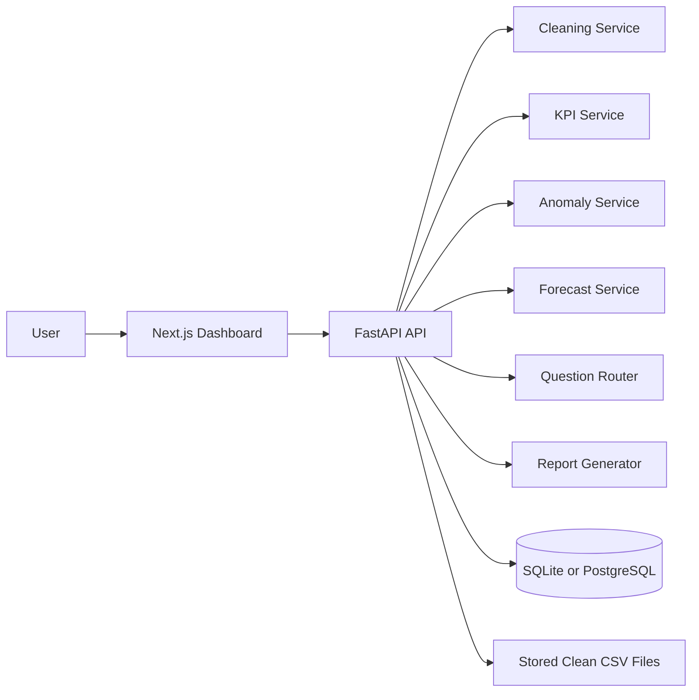

# AI Energy Data Analyst

AI Energy Data Analyst is a production-style portfolio project for renewable energy operations data. It combines a FastAPI analytics backend with a Next.js dashboard for uploading solar or wind datasets, cleaning data, calculating KPIs, detecting anomalies, forecasting output, asking plain-English data questions, and generating an HTML business report.

## Features

- CSV and Excel upload
- streamed uploads with a configurable file-size limit
- automatic column standardization, type inference, missing-value repair, duplicate removal, and negative-value handling
- KPI dashboard for output, daily average, peak output, downtime, missing data, and asset ranking
- anomaly detection with z-score, rolling median, low-output checks, and Isolation Forest
- 7, 14, and 30 day forecasting with regression and moving-average baseline
- safe natural-language question routing to approved analysis functions
- HTML report with executive summary, KPIs, anomalies, and forecast
- SQLite for local development and PostgreSQL through Docker Compose
- pytest backend tests and frontend TypeScript checking in CI

## Tech Stack

Backend: Python, FastAPI, pandas, NumPy, scikit-learn, SQLAlchemy, SQLite/PostgreSQL

Frontend: Next.js, TypeScript, Recharts, lucide-react

Quality: pytest, Docker, GitHub Actions

## Architecture



## Project Structure

```text
backend/
  app/
    api/
    database/
    models/
    services/
  tests/
frontend/
  app/
  components/
  lib/
data/sample/
storage/
reports/
```

## Local Setup

Backend:

```powershell
cd backend
python -m venv .venv
.\.venv\Scripts\Activate.ps1
pip install -r requirements.txt
uvicorn app.main:app --reload
```

Frontend:

```powershell
cd frontend
npm install
npm run dev
```

The frontend defaults to `http://localhost:8000/api`. For a different backend URL, copy `frontend/.env.example` to `frontend/.env.local` and change the value before starting Next.js.

Open the dashboard at [http://localhost:3000](http://localhost:3000). The API runs at [http://localhost:8000/docs](http://localhost:8000/docs).

Uploads are limited to 50 MB by default. Set `MAX_UPLOAD_SIZE_MB` in `.env` to change the limit.

## Docker Setup

```powershell
docker compose up --build
```

This starts PostgreSQL, FastAPI, and the Next.js frontend.

## Sample Dataset

Use `data/sample/solar_operations_sample.csv` to test the app immediately. It contains daily inverter output, weather fields, capacity, and a couple of operational anomalies.

## API Endpoints

- `POST /api/upload`
- `GET /api/datasets`
- `GET /api/datasets/{dataset_id}/summary`
- `GET /api/datasets/{dataset_id}/kpis`
- `GET /api/datasets/{dataset_id}/charts`
- `GET /api/datasets/{dataset_id}/anomalies`
- `GET /api/datasets/{dataset_id}/forecast?days=7`
- `POST /api/datasets/{dataset_id}/ask`
- `GET /api/datasets/{dataset_id}/report`

## Example Questions

- Which asset is underperforming?
- Are there any anomalies in the dataset?
- What is the forecast for the next 7 days?
- Explain the output trend.
- Give me a business summary.

## Testing

```powershell
cd backend
pytest
```

```powershell
cd frontend
npm run typecheck
```

## Portfolio Notes

This project is designed to show Python data analysis, backend engineering, applied machine learning, safe AI-assisted analytics patterns, and full-stack product delivery in one coherent application.
