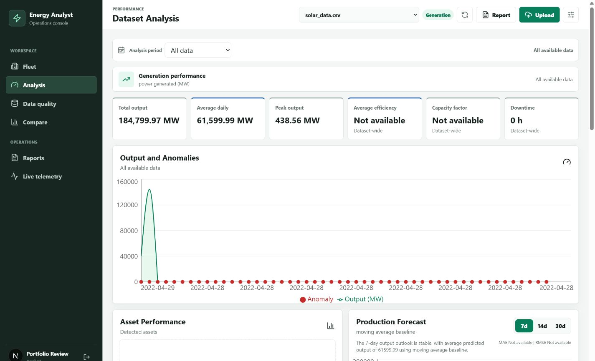
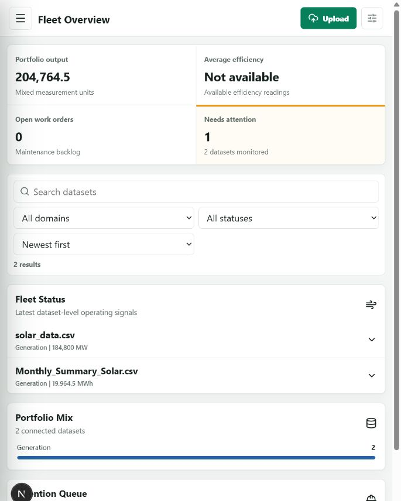
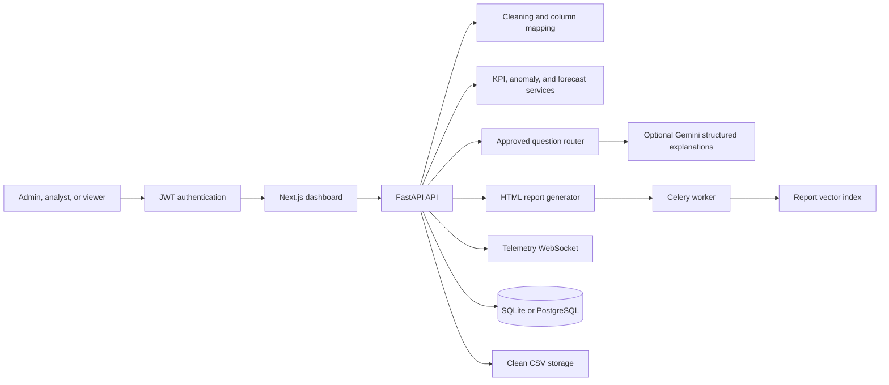

# AI Energy Data Analyst

[](https://github.com/ammar081/AI-Energy-Data-Analyst/actions/workflows/ci.yml)

AI Energy Data Analyst is a full-stack renewable-energy operations tool built for analysts and engineering teams. It turns raw solar, wind, demand, weather, or maintenance files into a validated dataset, an accessible operations workspace, energy KPIs, anomaly evidence, forecasts, safe natural-language analysis, and a business-ready HTML report.

## Problem Statement

Renewable operations data is often spread across telemetry exports with inconsistent column names, missing readings, duplicated events, and unclear status semantics. Analysts need a repeatable way to assess production, identify assets that deserve attention, estimate future output, and communicate findings without allowing an LLM to execute arbitrary code or invent calculations.

This project keeps calculations deterministic in Python. The optional Gemini layer classifies ambiguous questions into approved intents and explains verified aggregate findings through Pydantic-validated structured outputs.

## Deployment Preview

The repository includes a one-click Render Blueprint in `render.yaml` for the Next.js app, FastAPI service, and PostgreSQL database. The configured application URL will be:

[https://ammar081-energy-analyst.onrender.com](https://ammar081-energy-analyst.onrender.com)

The URL becomes available after the Blueprint is connected and the first deployment completes. Free Render services can take a short time to wake after inactivity.

## Screenshots

### Fleet Operations Overview


### Domain Analysis Dashboard



### Data Quality Inspection


### Responsive Workspace

<p align="center">
  
</p>

### Generated Report


The application screenshots use local synthetic or public demonstration data. Values are illustrative and are not presented as live plant telemetry.

## Features

- CSV and Excel upload with type and size validation
- column standardization, datetime and numeric inference, duplicate removal, missing-value repair, invalid negative handling, and outlier evidence
- original and cleaned row counts, inferred dtypes, per-column missing values, analysis mapping, and sample-row inspection
- total, average daily, peak, lowest, capacity factor, status-aware downtime, original missing-data percentage, and asset rankings
- direct or calculated average efficiency using efficiency, expected-output, or capacity columns
- demand-specific consumption, peak demand, load factor, variability, peak-period, and demand-forecast analysis
- maintenance work-order backlog, repair duration, cost, availability, event-type, and asset-reliability analysis
- daily production, asset comparison, weather relationship, anomaly overlay, and forecast charts
- z-score, rolling-average, Isolation Forest, good-weather/low-output, repeated-zero, missing-telemetry, and telemetry-gap detection
- 7, 14, and 30 day forecasts with Holt-Winters, regression, or moving-average fallback, confidence ranges, MAE, and RMSE
- safe question routing for approved analysis functions, including month-aware asset comparison, largest daily drop, and factor correlations
- structured business explanations covering what happened, why it matters, a possible reason, and the next action
- chart-rich HTML report with data quality, KPIs, anomalies, forecast, executive summary, and recommendations
- permanent dataset deletion for database metadata, raw uploads, and cleaned files
- responsive application shell with desktop navigation, mobile navigation, and role-aware commands
- fleet search, domain and status filters, sorting, pagination, portfolio mix, and operational attention queue
- domain-specific dashboards for generation, demand, maintenance, and combined generation-and-demand datasets
- bookmarkable URL state for workspace views, selected datasets, rolling periods, and custom date ranges
- consistent MW, MWh, percentage, time, and configurable maintenance-currency formatting
- persisted system, light, and dark themes plus density, page-size, currency, and default-period preferences
- expandable mobile data rows that replace horizontal table scrolling on smaller screens
- consistent loading, empty, success, progress, and actionable error feedback across operational views
- keyboard navigation, focus management, screen-reader labels, chart summaries, reduced-motion support, and automated accessibility checks
- JWT authentication with administrator, analyst, and viewer permissions
- administrator workspace for user roles, account status, usage totals, datasets, and reports
- fleet comparison for two to six datasets with domain-aware ranking
- Redis-backed Celery report jobs with immediate execution for simple local Python runs
- vector-ranked search across stored report findings and recommendations
- authenticated live telemetry simulation with expected-value and deviation tracking
- bounded caching and anomaly sampling for multi-million-row datasets
- SQLite locally, PostgreSQL in Docker and Render, plus Docker Compose and GitHub Actions
- pytest and Ruff backend coverage plus Vitest, React Testing Library, Playwright, and axe-core frontend coverage

## Tech Stack

Backend: Python 3.12, FastAPI, pandas, NumPy, scikit-learn, statsmodels, Google Gen AI SDK, Pydantic, SQLAlchemy, SQLite/PostgreSQL, Celery, Redis

Frontend: Next.js 16, React 19, TypeScript, Recharts, lucide-react

Quality and delivery: pytest, Ruff, Vitest, React Testing Library, Playwright, axe-core, Docker, Docker Compose, GitHub Actions, Render Blueprint

## Architecture



The Gemini API never receives the full uploaded dataset. It receives only bounded, computed findings. Recognized questions use the local rules router immediately. When `GEMINI_API_KEY` is absent, Gemini times out, or an API request fails, the same endpoint returns a transparent deterministic explanation with `source: "rules"`.

## Project Structure

```text
backend/app/          FastAPI routes, schemas, database, and analysis services
backend/tests/        Unit and end-to-end API tests
frontend/app/         Next.js application shell and responsive styling
frontend/components/  Dashboard experience
frontend/lib/         Typed API client
frontend/tests/       Unit, component, accessibility, and end-to-end tests
data/sample/          Synthetic dataset for local evaluation
docs/screenshots/     Verified application and report screenshots
render.yaml           Production deployment Blueprint
```

## Local Setup

Prerequisites: Python 3.12+, Node.js 22+, and npm.

Backend:

```powershell
cd backend
python -m venv .venv
.\.venv\Scripts\Activate.ps1
pip install -r requirements.txt
uvicorn app.main:app --reload
```

Frontend in a second terminal:

```powershell
cd frontend
npm ci
npm run dev
```

Open [http://localhost:3000](http://localhost:3000). Create the first account to establish the workspace administrator; later registrations receive the analyst role until an administrator changes them. Interactive API documentation is available at [http://localhost:8000/docs](http://localhost:8000/docs).

Copy `.env.example` to `.env` only when you need configuration changes. Add `GEMINI_API_KEY` to enable Gemini-assisted intent classification, explanations, and executive summaries. Keep the key server-side; the app remains fully functional without it.

## Docker Setup

```powershell
docker compose up --build
```

This starts PostgreSQL, Redis, FastAPI, a Celery worker, and Next.js at the same local URLs. Docker Compose forwards `GEMINI_API_KEY` from your environment when it is set. Direct Python runs use eager Celery execution by default, so Redis is not required outside Docker.

Role permissions:

| Role | Access |
| --- | --- |
| Viewer | Dashboards, data quality, forecasts, questions, comparisons, reports, and live telemetry |
| Analyst | Viewer access plus uploads and background report generation |
| Admin | Full access plus deletion, user roles, account status, and workspace statistics |

## API

| Method | Endpoint | Purpose |
| --- | --- | --- |
| POST | `/api/auth/register` | Create an account; the first account becomes administrator |
| POST | `/api/auth/login` | Issue a signed bearer token |
| GET | `/api/auth/me` | Return the authenticated user |
| POST | `/api/upload` | Upload and clean CSV or Excel data |
| GET | `/api/datasets` | List saved dataset metadata |
| DELETE | `/api/datasets/{id}` | Permanently remove a dataset and its stored files |
| GET | `/api/datasets/{id}/summary` | Inspect columns, types, missing values, cleaning, and samples |
| GET | `/api/datasets/{id}/kpis` | Calculate energy and asset KPIs |
| GET | `/api/datasets/{id}/charts` | Return chart-ready aggregate series |
| GET | `/api/datasets/{id}/anomalies` | Detect and explain unusual events |
| GET | `/api/datasets/{id}/forecast?days=14` | Forecast 7, 14, or 30 days |
| POST | `/api/datasets/{id}/ask` | Run a safe natural-language analysis intent |
| GET | `/api/datasets/{id}/report` | Generate the HTML performance report |
| GET | `/api/datasets/{id}/demand` | Calculate demand metrics and a demand forecast |
| GET | `/api/datasets/{id}/maintenance` | Analyze work orders, repair time, cost, and availability |
| GET | `/api/comparison?dataset_ids={id}` | Compare two to six datasets |
| POST | `/api/datasets/{id}/reports` | Queue a stored report job |
| GET | `/api/jobs/{job_id}` | Inspect background job status |
| GET | `/api/reports/search?q={query}` | Vector-rank stored report passages |
| WS | `/api/telemetry/{id}/stream` | Stream authenticated simulated telemetry |
| GET | `/api/admin/users` | List users for administrators |
| GET | `/api/admin/stats` | Return administrator workspace totals |

## Example Questions

- Which plant produced the most energy this month?
- Which day had the biggest production drop?
- Are there any anomalies in the dataset?
- Which asset is underperforming?
- What is the forecast for the next 14 days?
- What factors seem related to low production?

## Example Report Output

> Total output is 19,842.6. INV-01 is the highest-producing asset, while INV-03 needs comparison under similar weather conditions. Three medium-priority operating events require review. The 7-day Holt-Winters outlook is stable, with MAE and RMSE shown beside the confidence range.

The exported report also includes the cleaning summary, KPI grid, inline SVG charts, anomaly evidence, daily forecast table, model errors, explanation provenance, and recommended actions.

## Data Sources

The included sample is synthetic. See [data/README.md](data/README.md) for attribution and download links for NREL, Open Power System Data, ENTSO-E, Kaggle solar generation, Open-Meteo, and Meteostat datasets.

## Testing

```powershell
cd backend
ruff check app tests
pytest
```

```powershell
cd frontend
npm run typecheck
npm run test:component
npm run test:e2e
```

The 23-test backend suite covers cleaning evidence, role permissions, generation and demand KPIs, maintenance work orders, advanced forecasting, anomaly rules, safe question behavior, report jobs, vector search, upload limits, and complete API workflows. The frontend suite adds 13 unit and component tests plus four Playwright scenarios for desktop navigation, mobile disclosures, preference persistence, combined operations, and serious or critical accessibility violations.

GitHub Actions currently runs backend Ruff and pytest checks alongside frontend type checking and the production build for every pull request and every push to `main`.

## Deployment

1. Push the repository to GitHub.
2. In Render, create a Blueprint and select this repository.
3. Confirm the three resources from `render.yaml`.
4. Provide `GEMINI_API_KEY` when prompted, or leave it empty to use rules-based explanations.
5. After the first deploy, verify `/api/health`, upload the sample dataset, and open the generated report.

The Blueprint keeps the API key out of source control, injects the managed PostgreSQL connection string, waits for passing GitHub checks before auto-deploying, and uses health checks for both web services.

## Future Improvements

- object storage for durable cloud uploads and generated reports
- email verification, password recovery, and plant-level access policies
- forecast model registry and automated drift monitoring
- external CMMS synchronization for work-order updates
- production telemetry ingestion and alert notifications
